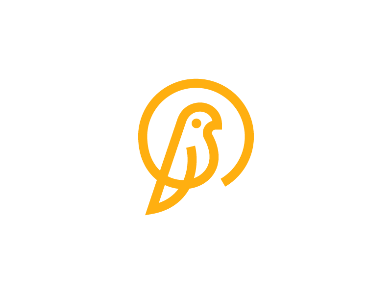

    <h1>Canary API - Open Source Social Meeting Platform</h2>
</img>

Experience with other

# Geo Location and Mapping
* Map Box SDK

# Backend
* NodeJS (Express JS)
* MongoDB
    * Storing geo points
* Elastic Search
    * Sync with MongoDB database
    * Advanced search queries

# Frontend
* Flutter
